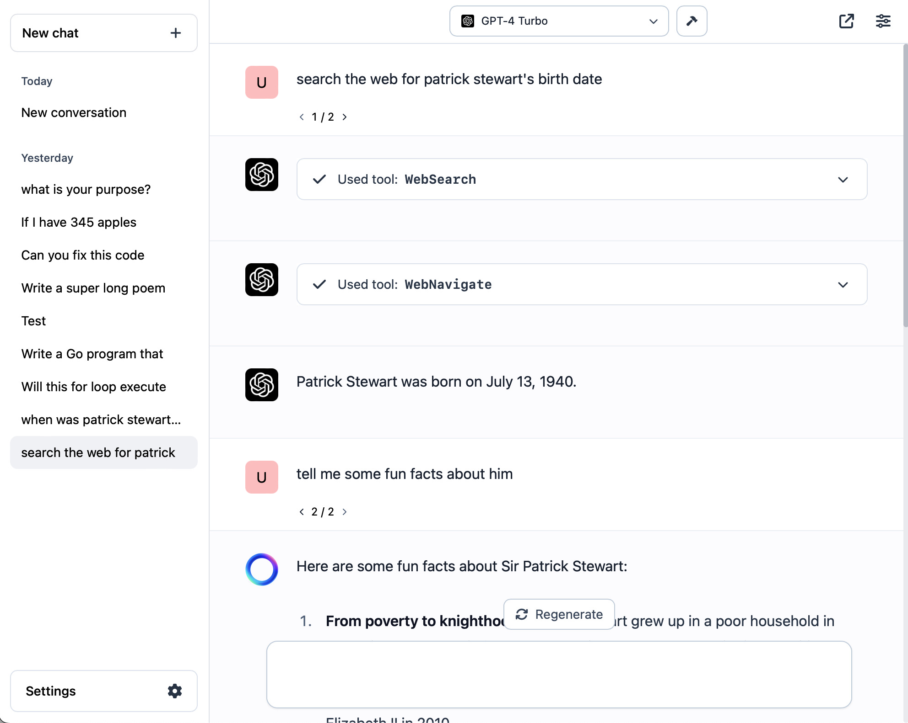

# lluminous

### A fast, light, open chat UI




### Key features:

- Multiple providers, plug in your API keys (stored entirely locally) and you're good to go
    - Local models (through llama.cpp)
    - OpenAI
    - OpenRouter (which lets you use ALL models across many providers: OpenAI, Anthropic, OSS, 50+ others)
    - Groq
    - Anthropic (coming soon)

- Tool use. Works with OpenAI, Anthropic, and Groq models. Parallel tool calls are supported.
    - Check out `server/tools/tools.go`. You only need to write functions. The function comment is the description the model receives, so it knows what to use. Click the `Sync` button in the web UI to refresh your tools.
- Multimodal input: upload, paste, or share links to images
- Image generation using DALL-E 3
- Multi-shot prompting. Also edit, delete, regenerate messages, whatever. The world is your oyster
- Pre-filled responses (where supported by provider)
- Support for all available models across all providers
- Change model mid-conversation
- Conversation sharing (if you choose to share, your conversation has to be stored on an external server for the share link to be made available. Self-hosted share options coming soon. No, I will not view any of your stuff.)
- Branching conversation history (like the left-right ChatGPT arrows that you can click to go back to a previous response)

Coming soon:
- Memory tool
- File ingestion/embedding
- Embeddings-based web search (a-la Perplexity)
- Prompt templates

### Privacy:
- Completely private and transparent. All your conversation history and keys are stored entirely locally, and kept only in your browser, on your device.

## How to install?

If you don't want to use tools, you don't need to install anything. A hosted instance is available at: https://lluminous.chat

If you want to use tools, proceed below.

## Single binary:

The server and client are available prebuilt as a single binary. [Download prebuilt packages from the releases page.](https://github.com/zakkor/lluminous/releases)

Download the binary for your platform, then run it, which will start both the client and the server:

```
./lluminous-darwin-amd64
Running at http://localhost:8081
```

Open the link in your browser and you're good to go!

If you want to **build your own tools** and recompile into a single client+server binary, download `dist-client.tar.gz` from the releases page and unzip it into `server/dist-client`, then run:

```
go build -tags release
```

This will get you a new binary which contains the tools you just added, and works just like before.

Alternatively, you can proceed below with a full setup of both the client and server.

### Separate installation of both client and server:

1. Clone the repository
2. Install and start the client: `npm i && npm run dev`. The client will be accessible at http://localhost:5173
3. Install and start the server: `cd server && go generate ./... && go build && ./server -password chooseapassword -llama "path/to/llama.cpp (optional)`. The server will be accessible at http://localhost:8081. You can plug this into the server address in the chat UI, along with the password you selected.


